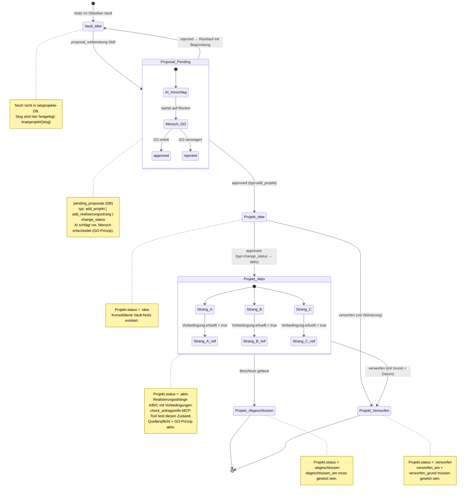

# Projektlebenszyklus — ratsprojekte

> **Kanonisches Lifecycle-Dokument.** Dieses Dokument ist der verbindliche
> Bezug für alle Skills, MCP-Tools und AI-Workflows, die mit
> ratsprojekte-Projekten arbeiten. Bei Änderungen am Lifecycle (neue States,
> neue Übergänge, neue Gates) wird dieses Dokument aktualisiert — und nur
> dieses.

## Zustandsdiagramm



## Legende: Statuswerte und ihre Bedeutung

| Chart-State | `Projekt.status` in DB | Wo existiert es? |
|---|---|---|
| `Vault_Idee` | *(nicht in ratsprojekte-DB)* | Nur im Obsidian-Vault |
| `Proposal_Pending` | *(nicht in `projekte.status`, sondern in `pending_proposals.status`)* | `pending_proposals`-Tabelle |
| `Projekt_Idee` | `:idee` | `projekte.status` |
| `Projekt_Aktiv` | `:aktiv` | `projekte.status` |
| `Projekt_Abgeschlossen` | `:abgeschlossen` | `projekte.status` |
| `Projekt_Verworfen` | `:verworfen` | `projekte.status` |

## Legende: Übergänge und ihr Enforcement-Status

Der Chart ist **teilweise deskriptiv, teilweise normativ** — er zeigt den
gewünschten Lifecycle, nicht den heute vollständig enforcebaren.

| Übergang | Im Code enforced? | Anmerkung |
|---|---|---|
| `Vault_Idee → Proposal_Pending` | nein | manueller Skill-Aufruf durch `proposal_vorbereitung` |
| `Proposal_Pending → Projekt_Idee` (nur via `approved`) | ✅ ja | via `decision_changeset`, `validate_inclusion(:status, [:approved, :rejected])` |
| `Proposal_Pending → Vault_Idee` (rejected-Rücklauf) | ❌ nein | kein Reopen-Pfad im Code; Skill-Spezifikation |
| `Projekt_Idee → Projekt_Aktiv` (nur via approved change_status) | ❌ nein | `Projekt.changeset` erlaubt jede Direction; Chart ist normativ |
| `Projekt_Aktiv → Abgeschlossen/Verworfen` | ❌ nein | jede Direction erlaubt; Chart ist normativ |
| `abgeschlossen_am` / `verworfen_am` gesetzt | ⚠️ soft warning | `validate_status_dates/1` in `projekt.ex` — nur Changeset-Error, keine DB-Constraint |
| `Realisierungsstrang.bedingung_erfuellt` | ❌ nein | Boolean, frei setzbar; keine Guard-Logik, die es an Projekt.status koppelt |

### Was im Code *heute* wirklich enforced ist

- **`PendingProposal.status`:** `pending → approved | rejected` (einmalig, via
  `decision_changeset`). Das ist die einzige genuinely enforced Lifecycle im
  Codebase.
- **`Projekt.status`:** ein flaches 4-Wert-Enum (`:idee`, `:aktiv`,
  `:abgeschlossen`, `:verworfen`) **ohne Transition-Guards**. Jeder Status kann
  heute in jeden anderen wechseln.
- **Soft coupling:** `validate_status_dates/1` warnt, wenn
  `abgeschlossen_am`/`verworfen_am` fehlt — aber nur als Changeset-Error, nicht
  als DB-CHECK-Constraint.

Der Chart ist also **Spezifikation + Dokumentation**: er zeigt, wo der
Lifecycle hin soll. Wenn Transitions-Guards später im Ecto-Changeset
nachgezogen werden, ist dieser Chart die Referenz.

## Beziehung zum Vault-Workflow

```
Obsidian-Vault (Source of Truth, roh)
    │
    │  proposal_vorbereitung-Skill: sammeln → konsolidieren → Gates prüfen
    ▼
ratsprojekte (Distillat, strukturiert, antragsreif)
```

- **Vault → ratsprojekte** ist strikt einseitig (AGENTS.md §10). Kein Rückfluss.
- Der Slug ist der stabile Vertrag: `#ratsprojekt/{slug}` als Vault-Tag,
  `/projekte/{slug}` als ratsprojekte-URL, `slug` als MCP-Parameter.
- Eine `rejected`-Proposal geht konzeptionell in den Vault zurück (neuer
  Erkenntnisstand), nicht zurück in `pending_proposals`.

## Lifecycle-Pflicht für Skills und AI-Workflows

Jeder Skill, jedes MCP-Tool und jede AI-Sitzung, die den Status eines
Projekts berührt (lesen, vorschlagen, ändern), **muss**:

1. **Diesen Lifecycle kennen** — indem die Skill-Datei oder AGENTS.md auf dieses
   Dokument verweist.
2. **Sich danach richten** — keine Status-Übergänge vorschlagen, die der Chart
   nicht zeigt. Beispiel: ein Skill darf nicht `abgeschlossen → idee`
   vorschlagen, auch wenn der Code es heute erlaubt.
3. **Bei Workflow-Änderungen dieses Dokument aktualisieren** — bevor ein neuer
   Status, Übergang oder ein neues Gate in Code oder Skill gegossen wird,
   wird er zuerst hier eingetragen. Das Dokument ist der Single Source of
   Truth für den Lifecycle.

### Wann das Dokument zu aktualisieren ist

- Neuer `Projekt.status`-Wert oder neuer `PendingProposal`-Typ → Chart + Legende
- Neue Transition oder neues Gate → Chart + Enforcement-Tabelle
- Änderung am Vault→ratsprojekte-Datenfluss → Abschnitt "Beziehung zum Vault-Workflow"
- Änderung an Slug-Konvention oder Quellenpflicht → entsprechenden Abschnitt

### Wann *nicht*

- Reine UI-Änderungen, die keine neuen States/Transitions einführen
- Refactoring, das das Verhalten unverändert lässt
- Neue MCP-Tools, die nur lesen (keine Status-Mutation)
