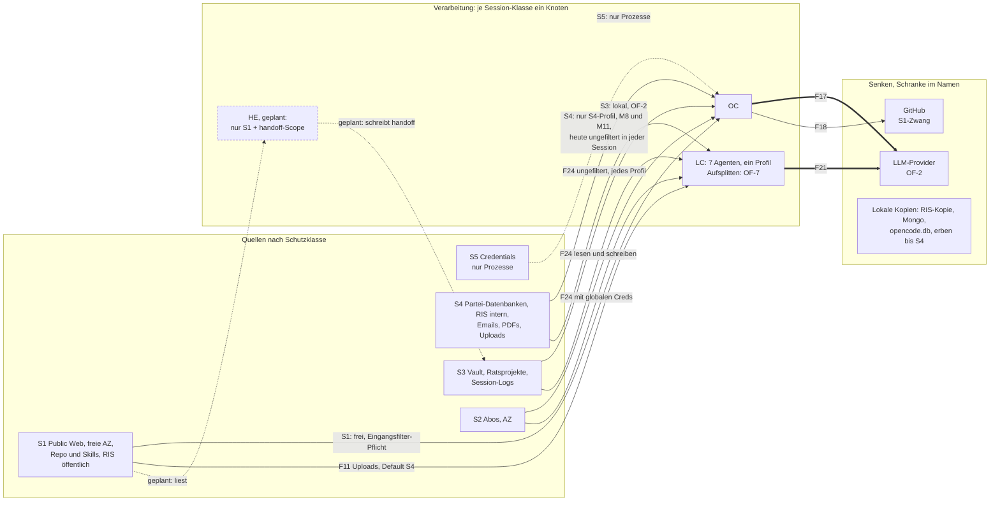
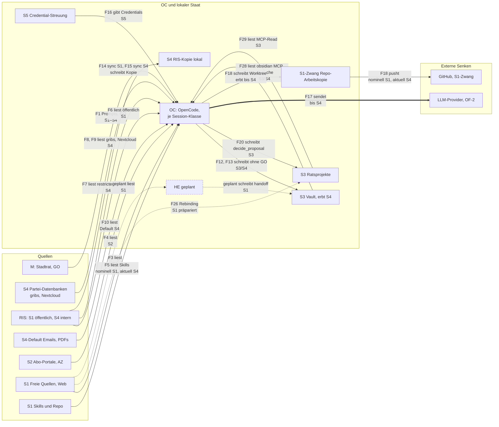
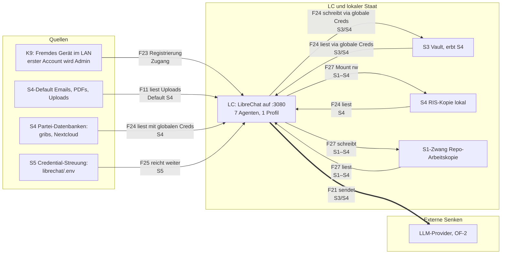
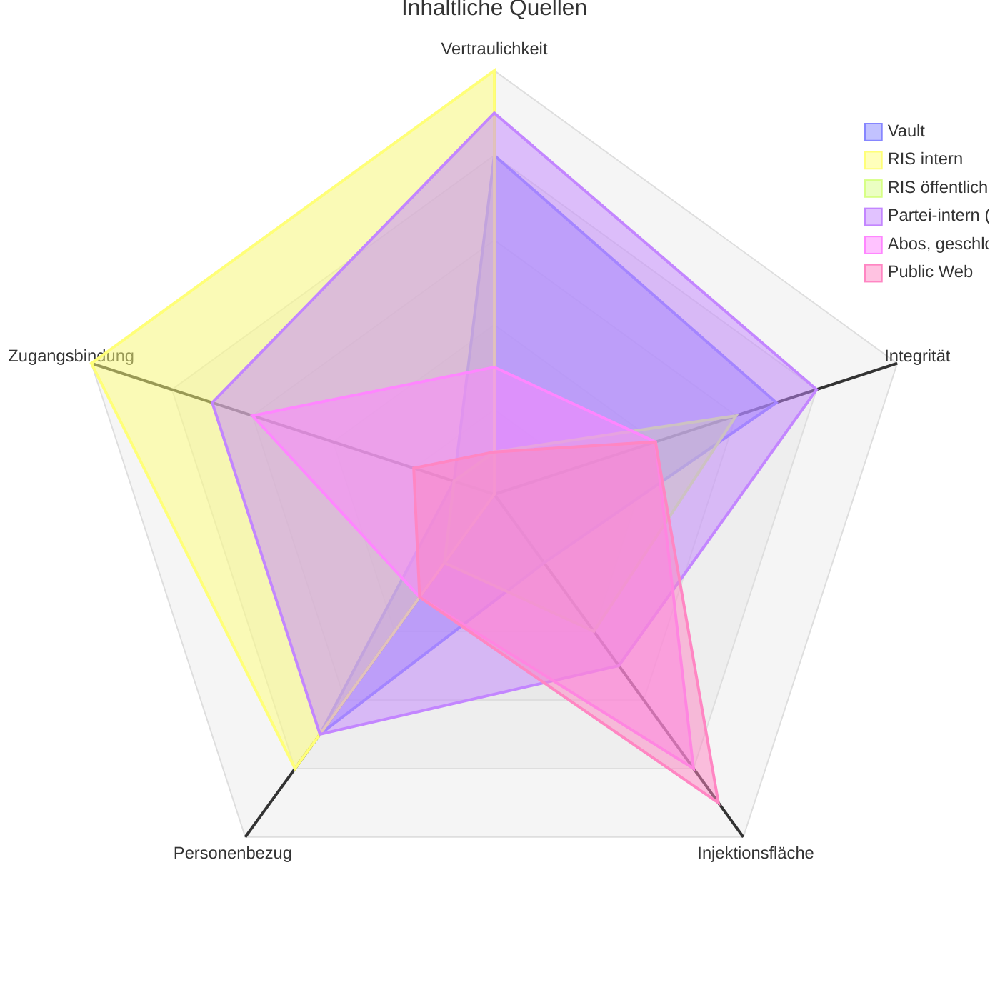
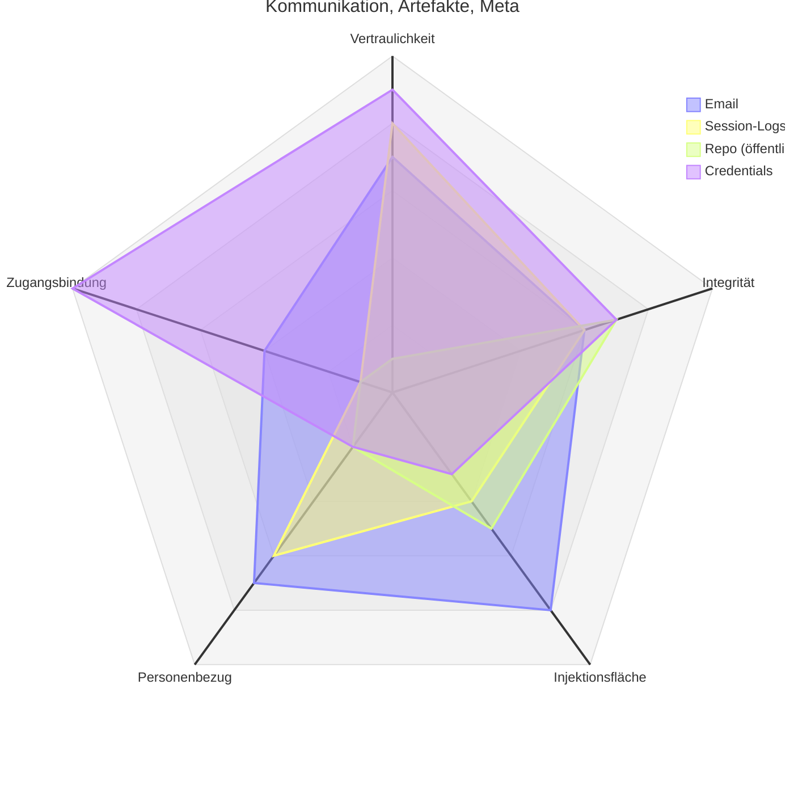

# RFC 0000: Sandbox-Threat-Modell für kommunalpolitik_ki

| Feld | Wert |
|---|---|
| Status | Outdated. Überholt durch RFC 0001: Vertrauliche KI-Arbeit durch gebundene Arbeitsräume |
| Datum | 2026-09-04 |
| Modus | Nur Planung. Nichts wird gebaut. Jede Massnahme braucht vor Umsetzung ein GO (Repo-Prinzip 7) |

> RFC-Konvention: RFCs liegen unter `docs/rfcs/`, Name `NNNN-slug.md`, Status im Kopf. Dies ist der erste RFC im Repo.

## Zusammenfassung

Die zwei AI-Harnesses des Systems, die OpenCode-Session (OC) und die LibreChat-Agenten (LC, Abschnitt 2), besitzen die höchsten Privilegien (Dateisystem, Vault, Datenbanken, Netz, Code-Ausführung) und konsumieren gleichzeitig ungefiltert fremdbestimmten Inhalt. Wer eine Quelle kontrolliert, ein Artikel, eine Email, ein Upload, ein Gerät im WLAN, steuert damit die Komponente mit den meisten Rechten. Die drei schwerwiegendsten Verstösse:

1. Injektion in die Vollzugriffs-Session: untrusted Inhalt erreicht die Session, deren Werkzeuge ungebremst schreiben und ausführen (F3, F4, F10, F11 auf F12 bis F20).
2. Exfiltration ohne Entscheidung: Interne Daten verlassen das Gerät im Regelbetrieb über unbefragte Kanäle. Die LLM-Provider sind der grösste Fall (F17, F21); ob lokal oder vertrauenswürdiger Anbieter, entscheidet der Mensch (OF-2), nicht der Agent. Regel 2 gilt kanalunabhängig: Git-Push (F18) zählt genauso wie jede Strecke, die sich eine Session mit Bash und Web-Zugriff selbst wählt (Mail, Upload, Web-Post). Ein technischer Filter existiert auf keinem dieser Wege.
3. Geteilte Identität in LibreChat: Alle sieben Agenten laufen auf denselben globalen Credentials, und die Werkzeuge prüfen nicht, wer fragt. Jede Identität, die die Oberfläche erreicht, erhält die volle Werkzeugmacht (F24). Der offene Port 3080 (F23) ist nur das einfachste Symptom und ein Config-Fix (M1); das architekturelle Problem ist die geteilte Identität (Kette 2, M10).

Sofortmassnahmen als Vorschlag: M1 bis M3, danach M8 (Abschnitt 7). Nichts davon ist umgesetzt.

## 1. Fragestellung und Regeln

Welche Daten fliessen von welcher Komponente zu welcher Komponente, lesend oder schreibend, und welche Flüsse verletzen die Vertrauensregeln?

Vier Regeln, an denen sich jeder Fluss messen lässt:

- **Regel 1 (Injektion).** Inhalt aus untrusted Quellen steuert keine Komponente mit Schreib- oder Ausführungsbefugnis.
- **Regel 2 (Exfiltration).** Interne Daten verlassen das Gerät nur über Flüsse, die der Mensch bewusst entschieden und dokumentiert hat.
- **Regel 3 (Mutation).** Keine Komponente verändert Vault oder Projektdaten ohne menschliches GO.
- **Regel 4 (Klasse).** Eine Session verarbeitet Inhalte höchstens bis zur Klasse, für die sie gestartet wurde. Die Klasse steuert das Profil beim Start, Werkzeuge, Netz, Dateisystem, nicht einen Nachher-Filter; der Kontext ist un-entgiftbar.

Als Gate zählt nur eine technische Hürde, die eine injizierte Anweisung nicht überwinden kann. Prozessregeln und Prompt-Disziplin zählen nicht als Gate. Dasselbe gilt in Gegenrichtung: Wer KI an Daten der Stufen S3 und S4 lässt, braucht eine Komponente, die technisch nicht exfiltrieren kann. Netzlosigkeit oder eine explizite Web-Whitelist ist das Gate, nicht die Providerwahl allein (M11).

Methode: rein statisch, nur Code und Doku gelesen, kein Netz, keine laufenden Services, keine Schreibzugriffe ausserhalb des Worktrees, keine Commits. Secret-Werte werden nie wiedergegeben, nur Speicherorte und Feldnamen. Belege im Format `datei:zeile`. Analysiert am 2026-09-03 im Worktree `threat-modelling` und im Main-Checkout (dort untracked: librechat/, tools/obsidian_mcp, tools/ratsinfo_mcp, tools/nextcloud_ods_mcp, skills/antrag_generieren, skills/bericht_aus_dem_stadtrat). Tragende Aussagen wurden stichprobenartig am Code verifiziert, ein unabhängiger Review hat den Entwurf gegengeprüft. Ein früherer Architektur-Entwurf, handoff-architecture.md, dient in Abschnitt 6 als Massstab.

## 2. Komponenten

Das Privileg einer Komponente ist das Triple (lesen, schreiben, ausführen): auf welche Daten sie lesend oder schreibend zugreifen kann und welche Code-Ausführung sie anstossen kann. Vertrauen ergibt sich aus dem Können, nicht aus der Absicht. Der Schnitt folgt Systemen: Jede Komponente ist ein System mit eigener Identität und eigenem Schutzbedürfnis; Werkzeuge ohne eigene Identität, die stdio-MCPs und gribs_mcp, gehören zum Harness. Auf demselben Abstraktionsniveau wie die Quellen: Klassen statt Instanzen, die Instanz steht in Klammern. Die Tabelle nennt pro Komponente einen Satz, was sie kann; Belege stehen bei den Flüssen (Abschnitt 3).

| ID | Komponente | Kann |
|---|---|---|
| M | Stadtrat (Mensch) | Alles entscheiden; einzige GO-Instanz; legt die Session-Klasse beim Start fest. |
| OC | OpenCode, AI-Harness | Gleichgestellt mit LC: ruft LLM-Provider und alle MCPs auf; liest und schreibt Dateien, Vault, SQLite und Git; führt Bash und Code aus. Läuft mit vollen Nutzerrechten auf dem Laptop. Ein Knoten je Session-Klasse. |
| LC | LibreChat, AI-Harness | Gleichgestellt mit OC: ruft LLM-Provider und alle MCPs auf und schreibt darüber in Vault, RIS-Cache und Repo. Kein Terminal, läuft im Container; über :3080 von anderen Geräten erreichbar. Ein Profil für alle sieben Agenten (OF-7). |
| HE | Hermes, autonomer Assistent (geplant) | Liest nur öffentliche Quellen (Web, AZ), schreibt nur nach handoff/ im Vault, als git-Branch; kein Terminal, kein Dateisystem. Geplant nach handoff-architecture.md, Massstab für M4 bis M8. |
| VA | Vault | Persönliche Notizen (S3); von OC und LC schreibbar; erbt bis S4 aus Sitzungsmappen; Persistenz lokal, Backup und Sync orthogonal zum Tooling. |
| RI | RIS samt lokaler Kopie | Öffentliche (S1) und rollengebundene (S4) Ratsinformationen; via ratsinfo lesbar, via sync lokal kopiert. |
| AP | Abo-Portale | Zugangsbeschränkte Abonnements (S2), Beispiel AZ-Volltext; gelesen über den eigenen Browser des AZ-MCP mit persistentem Login-Profil. |
| GR | Interne Partei-Datenbanken | Partei-intern (S4), Instanzen: gribs (Anträge, Positionen) und Nextcloud Fraktion (Unterlagen, .ods); via gribs_mcp und nextcloud_ods lesbar. |
| RP | Ratsprojekte | Projekt-Dashboard mit S3-Distillaten; Mutationen via decide_proposal, Debugging via Tidewave. |
| RE | Repo (öffentlich) | Tooling, Skills, Doku; S1-Zwang: was gepusht wird, ist öffentlich und unwiderruflich. |
| K7 | Freie und unvertraute Quellen | Public Web, Emails, PDFs, Uploads, PR- und Issue-Texte; Inhalt ist Angreifer-kontrollierbar; Klasse unbekannt bis zur Einordnung (Erbschafts-Default S4). |
| K8 | Externe Senken | LLM-Provider, GitHub-Remote; Empfänger aller Daten, die das Gerät verlassen. |
| K9 | Fremdes Gerät im LAN | Registriert sich bei LibreChat auf :3080 und erhält die volle Agenten-Oberfläche. |

Credential-Streuung: Keyring (AZ, RIS), ~/.config/kommunalpolitik_ki und ~/.newspaper_mcp (Browser-Profil des AZ-MCP, enthält die AZ-Login-Daten) dienen mehreren Systemen und gehören keinem allein (F16). Die eigene Persistenz von OC, opencode.db (S3, S4) und auth.json samt .bak (S5), und von LC, Mongo und librechat/.env, trägt dieselben Risiken (F19, F22, F25). Die fehlenden Gates der stdio-MCPs und gribs_mcp sind Risiko der Harness-Zeilen OC und LC.

## 3. Datenflüsse

**Formale Prüfung.** Das System ist ein gerichteter Graph: Quellen, Verarbeitung und Senken sind Knoten, die Flüsse Kanten. Jede Kante trägt die Schutzklasse des Inhalts, der tatsächlich maximal auf ihr läuft, nicht die nominale Absicht: Die Push-Kante ist nominal S1, tatsächlich bis S4. Zwei lokale Prüfungen an jedem Knoten genügen dann für den ganzen Graph:

1. **Nichts geht hinaus, was nicht hineinkam.** Kein Knoten verteilt Eingängen niederer Klasse auf Ausgänge höherer Klasse; nichts Unvertrautes gewinnt Autorität (Integrität).
2. **Nichts kommt hinein, was den Knoten übersteigt.** Jeder Knoten hat eine Schranke: die Senken-Klasse (Vault S3 mit Erbschaft bis S4, Repo S1-Zwang, Provider laut OF-2) oder, bei Sessions, die vom Menschen festgelegte Session-Klasse als höchste erlaubte Aufnahme.

Daraus folgen: Jeder Zyklus trägt eine einzige Klasse; der Graph schichtet sich nach dem Zusammenziehen gleichklassiger Kreise in einen geschichteten DAG mit den fünf Ebenen S5 bis S1; eine Vollprüfung kostet an jedem Knoten die Paarung seiner ein- und ausgehenden Kanten. Abwärtsbewegungen sind Deklassierung und brauchen ein benanntes Gate (Push, Veröffentlichen, restricted anzeigen). Verstösse erscheinen als verletzende Paare; Abschnitt 5 listet sie als Audit.

**Verarbeitungsknoten.** Verarbeitet werden die Quellen von zwei Komponenten: OC und LC. OC wird formal zu einem Knoten je Session-Klasse expandiert: eine Sitzung der Klasse c empfängt Kanten bis Klasse c, und Profil beim Start (MCP-Registrierung, Netz, Dateisystemrechte) folgt der Klasse, nicht einem Nachher-Filter. LC hat heute ein Profil für alle sieben Agenten; das Aufsplitten ist OF-7. Nur der AZ-MCP ist mehr als eine Rohre: Sein Playwright-Fallback betreibt einen eigenen Browser mit persistentem Profil und damit eigenem Netz-Zugang (F4). Alle übrigen stdio-MCPs gehören zum Harness (Abschnitt 2).

29 Flüsse. Modus lesend oder schreibend, manche mit Ausführung. Die λ-Spalte trägt die Kantenbeschriftung der formalen Prüfung: die Schutzklasse des Inhalts, der tatsächlich maximal auf der Kante läuft. Die Gate-Spalte nennt die technische Hürde am Fluss: was eine injizierte Anweisung überwinden müsste, um ihn zu nutzen (Definition in Abschnitt 1). Keins ist der Regelfall und der eigentliche Befund.

| Nr | Fluss | Von → Nach | Modus | λ (Ist) | Inhalt | Gate |
|---|---|---|---|---|---|---|
| F1 | Wort an die Session | M → OC | schreibend | S1–S4 | Prompts, GO; Kanal-Vertrauen ist nicht Inhalts-Vertrauen, eingefügte Emails und Artikel reiten hier | keins nötig, vertrauenswürdiger Absender; GO-Herkunft bleibt unverifizierbar (OF-6) |
| F2 | Wort an den Agenten | M → LC | schreibend | bis S4 | Chats; der Upload-Anteil ist K7-Fracht und läuft über F11 | keins nötig |
| F3 | Websuche | K7 → OC | lesend | S1 | Freies Web, freie AZ-Artikel, Web-Fetches ohne Domain-Whitelist (ratsprojekt_delta SKILL.md:44-56) | keins; Eingangsfilter-Pflicht (Abschnitt 4) |
| F4 | Abos | AP → OC | lesend | S2 | AZ-Volltexte; die Lesemaschine betreibt eigenes Netz, Drittanbieter-JS läuft, das Browser-Profil trägt die AZ-Login-Daten | keins |
| F5 | Skills als Anweisung | RE → OC | lesend | S4 aktuell, nominell S1 | Skill-Dateien als Prompt-Inhalt (skills.paths), auch die globalen Verzeichnisse ausserhalb des Repos; foerdermittel_recherche trägt hartkodierte Zahlen ohne eigene Quelle (SKILL.md:38, 66-71); M12 macht die Kante S1 | nur lokale Dateihoheit |
| F6 | Ratsinfo öffentlich | RI → OC | lesend | S1 | Agenda und Vorlagen für Weiterverarbeitung | keins nötig |
| F7 | Ratsinfo intern, explizit | RI → OC | lesend | S4 | RIS-intern; show-top --full schreibt nicht-öffentliche Textblöcke auf STDOUT (cli.ex:613-625) | keins; die Suche filtert restricted nicht (store.ex:166-183) |
| F8 | Partei-Wissen | GR → OC | lesend | S4 | gribs-Anträge via gribs_mcp, global konfiguriert; Downloads sind S4-Dateien in potenziell injizierbaren Formaten | keins |
| F9 | Fraktions-Unterlagen | GR → OC | lesend | S4 | Nextcloud-ODS via nextcloud_ods, jede .ods (parser.py:28-31) | keins |
| F10 | Unvertrautes Material | K7 → OC | lesend | unbekannt, Default S4 | Emails, jede PDF via pdf_ingest (server.py:124-237), unbekannte Dateien; Intention entscheidet | keins |
| F11 | Upload in den Agenten | K7 → LC | lesend | unbekannt, Default S4 | Upload-Inhalte in Agent-Prompts | keins |
| F12 | Mappe ohne GO | OC → VA | schreibend | S3/S4 | create_note überschreibt ungefragt (server.py:209-230); Sitzungsmappe und Bericht ausdrücklich ohne GO (sitzungsvorbereitung SKILL.md:423-426, bericht SKILL.md:418-420) | keins |
| F13 | Code im Obsidian-Prozess | OC → VA | schreibend, ausführend | S3/S4 | obsidian eval nimmt beliebigen Node-Code (sitzungsvorbereitung SKILL.md:222, 238) | keins |
| F14 | Sync öffentlich | RI → RI-Kopie | lesend, schreibend (lokal) | S1 | Agenda in die lokale Kopie, via ratsinfo | keins, S1-Automatik verträglich |
| F15 | Sync nimmt S4 mit | RI → RI-Kopie | lesend, schreibend (lokal) | S4 | restricted-Blöcke füllen die lokale Kopie inklusive S4, Downloads ohne Rechte-Härtung (ratsinfo_mcp server.py:119-130) | keins; gehört hinter S4-Absicht (Regel 4) |
| F16 | Schlüsselbund lesen | Credential-Streuung → OC | lesend | S5 | Keyring mit Env-Fallback (AZ, opencode.json:15-18), RIS in ~/.config/kommunalpolitik_ki | Nutzerrechte |
| F17 | Kontext zum Provider | OC → K8 | lesend, verlässt Gerät | S1–S4 je Session-Klasse | Prompt-Kontext im Regelbetrieb | nur Prompt-Disziplin |
| F18 | Push | OC → K8 | schreibend, verlässt Gerät | S4 aktuell, nominell S1 | Git-Push; untrackede Artefakte ohne Ignore-Schutz; gitleaks nur lokal, Remote ohne Secret-Scanning | keins; Deklassierung ohne benanntes Gate |
| F19 | Sitzungsgedächtnis | OC → OC | schreibend | S3/S4/S5 | Session-Transkripte in opencode.db, auth.json und auth.json.bak, Persistenz in eigener Sphäre | keins |
| F20 | Vorschlag per Chat | OC → RP | schreibend | S3 | decide_proposal: Projekte, Stränge, Status; kein Auth (router.ex:18-19), kein Origin-Check (dev.exs:12) | keins; GO kommt im Chat und ist dort unverifizierbar (OF-6) |
| F21 | Agenten-Prompts zum Provider | LC → K8 | lesend, verlässt Gerät | S3/S4 | Agent-Prompts | keins |
| F22 | Chats im Klartext | LC → LC | schreibend | S3/S4/S5 | Chats, Uploads, im UI gesetzte Provider-Keys nach Mongo, unverschlüsselte Persistenz in eigener Sphäre | unverschlüsselt |
| F23 | Offene Tür | K9 → LC | schreibend | Zugang | Registrierung über :3080, alle Interfaces, kein TLS; erster Account wird Admin (librechat/scripts/setup.sh:237) | ALLOW_REGISTRATION true (Live-Lesung 2026-09-03) |
| F24 | Ein Schlüssel für alle | LC → VA, RI, GR | lesend, schreibend | S2–S4 | MCP-Aufrufe mit globalen Credentials: Vault, RIS, AZ, gribs | Credentials nicht pro Nutzer getrennt |
| F25 | Schlüssel an alle Prozesse | LC → LC | lesend (Verteilung) | S5 | librechat/.env reicht alle Credentials an jeden MCP-Prozess der eigenen Sphäre | Nutzerrechte |
| F26 | Rebinding aufs Dashboard | K7 → RP | schreibend | S1 präpariert | präparierte Website erreicht /mcp per DNS-Rebinding aus dem Browser des Stadtrats | kein Auth, kein Origin-Check (dev.exs:12) |
| F27 | Container mit Hausschlüssel | LC ↔ VA, RI, RE | lesend, schreibend | S1–S5 | rw-Mounts: ..:/repo mit allen untrackeden Artefakten, /vault, /ratsinfo-cache, /gribs_mcp (override.yml:10); /komki-config ro | uv-Venv-Bedarf |
| F28 | Vault-Lektüre | VA → OC | lesend | S3/S4 | Obsidian-MCP-Read und vault_suche lesen Notizen in den Kontext; der Vault erbt bis S4 aus Sitzungsmappen, kein Profil schützt die Aufnahme | nur lokale Dateihoheit |
| F29 | Dashboard-Lektüre | RP → OC | lesend | S3 | Ratsprojekte-MCP-Read-Tools lesen Projekte und Stränge in den Kontext | nur lokale Dateihoheit |

**Diagramm A — Überblick: die zwei Hubs.** Die Flusstabellen bleiben verbindlich; hier stehen nur die Klassenregeln und ihre heutige Verletzung.

**Diagramm B — OC im Detail.** Alle Kanten nach OC, die Schreib- und Lese-Kanten auf Vault und Dashboard, die Sync-Kette, der Push über die Worktree-Kopie und der geplante Kontrast HE.

**Diagramm C — LC im Detail.** Eine Tür für sieben Agenten auf einem Credential-Satz; alle Zugriffe laufen mit denselben globalen Credentials oder über die rw-Mounts.

Alle drei Diagramme folgen dem handoff-architecture-Muster: Die Schutzklasse steht an jedem Knoten, Senken tragen ihre Schranke im Namen, jede Kante eine einzige Richtung mit Werkzeug und λ, der Klassenbeschriftung der formalen Prüfung, identisch mit der λ-Spalte der Flusstabelle. Lesen und Schreiben sind getrennte Kanten: Dem Schreibbefehl in den Vault (F12, F13) stehen die Lese-Flüsse F28 und F24 gegenüber, der Senke-als-Quelle-Loop ist so sichtbar. Der gestrichelte Kontrast: HE liest nur S1 und schreibt nur handoff/ mit fest codiertem Scope, genau das, was OC und LC heute ohne Gate tun (F12, F13). Persistenz innerhalb einer Sphäre (F19, F22) sowie die interne Credential-Verteilung (F25 übrige Ziele) stehen nur in der Tabelle. Dicke Pfeile (`==>`) kreuzen die Provider-Grenze. In B ist der Push-Kanal präzisiert: OC schreibt erst die Worktree-Kopie (erbt bis S4), der Push deklassiert sie nominell auf S1.

## 4. Datenklassifikation

Fünf Achsen, jede 0 bis 10, danach die Treppe S1 bis S5. Die Radars zeigen die Profile der Quellen, die Treppe die Ordnung.

| Achse | Frage | 0 heisst | 10 heisst |
|---|---|---|---|
| Vertraulichkeit | Was passiert, wenn der Inhalt das Gerät verlässt? | Leck folgenlos | Leck politisch und rechtlich teuer |
| Integrität | Was passiert, wenn jemand den Inhalt unbemerkt verbiegt und du auf der Fälschung entscheidest? | Fälschung folgenlos | Fälschung führt zu falschen politischen Entscheidungen |
| Injektionsfläche | Wie viel vom Inhalt können Dritte aktiv gestalten? | nur selbst geschrieben | präparierter Prompt-Injection-Träger: Web, PDF, ODS, Anhang |
| Personenbezug | Enthält der Inhalt Daten über identifizierbare Dritte? | keine | DSGVO-relevant: Namen, Meinungen, politische Einstellung |
| Zugangsbindung | An welche Verpflichtung hängt der Zugang? | frei abrufbar | Rolle: Kenntnisnahme durch Dritte ist Rechtsbruch mit persönlicher Haftung |

Integrität ist die Schadens-Achse, Injektionsfläche die Ursachen-Achse. Das Manipulationsrisiko ist Fläche mal Schaden; Email trägt beide hoch und ist damit der gefährlichste Input des Systems. Die Injektionsfläche bleibt bewusst ausserhalb der Treppe, als Fläche quer zu allen Stufen: Public Web ist S1 mit Eingangsfilter-Pflicht (Validierung, kein Auto-Execute, kein Vertrauen in Inhalt), RIS intern ist S4 ohne. Wer die Fläche in die Stufe mischt, verliert den Befund, dass offene Daten die Hauptangriffsfläche sind.

### Die Treppe S1 bis S5

Jede Stufe ist strenger als die vorige, gemessen daran, wer sehen darf und was ein Leck rechtlich bedeutet.

| Stufe | Name | Wer darf sehen | Leck-Folge | Mitglieder |
|---|---|---|---|---|
| S1 | Offen | alle | keine | RIS öffentlich, Public Web, Repo (öffentlich) |
| S2 | Lizenziert | ich, im vertraglichen Rahmen | Vertragsverletzung gegen mich | Abos, geschlossene Datenbanken (AZ-Abo) |
| S3 | Persönlich | nur ich und Betroffene | DSGVO-Verstoss, Schaden für Dritte | Vault, Email, ratsprojekte, Session-Logs |
| S4 | Rollengebunden | nur Rolleninhaber (Mandat, Mitgliedschaft) | Rechtsbruch, persönliche Haftung, politischer Schaden | RIS intern, Partei-intern (gribs, Nextcloud Fraktion) |
| S5 | Schlüssel | niemand ausser Prozessen | öffnet alle anderen Stufen | Credentials |

Erbschaftsregel: Behälter und Kondensate (Email-Postfach, Session-Logs, Dateisystem-Artefakte, Exporte) erben die höchste Stufe, die sie enthalten; eine Verwaltungs-Email macht das Postfach S4-führend. Unklassifiziertes gilt als S4, bis es eingeordnet ist. S5 nur für echtes Schlüsselmaterial.

Session-Klassen-Regel: Die Klasse einer Session ist die höchste Aufnahme, die sie zulässt, gelegt vom Menschen beim Start; Schreib- und Abflussfläche folgen der Klasse. Der Grad der Klasse steuert das technische Profil: S1 frei; S2 frei mit vertraglichem Abfluss-Dach; S3 lokal mit beantwortetem OF-2; S4 dediziert, netzlos oder Whitelist (M8, M11); S5 nur Prozesse, kein Agent-Kontext. Diese Regel ist Regel 4 aus Abschnitt 1 und macht jeden Session-Knoten in Abschnitt 3 zu einem Knoten je Klasse.

### Datensenken

Jede Senke ist die Quelle der nächsten Session, und zwei Komponenten, die dieselbe Senke schreiben und lesen, haben einen impliziten Fluss, den die Punkt-zu-Punkt-Tabelle nicht zeigt. OC-Background-Agenten (explorer, fixer, oracle) teilen denselben Worktree; OC und LC teilen Vault, RIS-Kopie und Repo-Mounts. OC schreibt die Sitzungsmappe in den Vault, LC liest sie: ein OC-zu-LC-Fluss ohne eigene F-Nummer. Das Dateisystem ist so ein Agenten-Austauschkanal.

| Senke | Erbt bis | Gelesen zurück von | Persistenz und Abfluss |
|---|---|---|---|
| Dateisystem, Arbeitsartefakte | S4, Kopien von allem möglich | OC, LC über Mounts | session-übergreifend; git push macht öffentlich |
| Vault | S4, Sitzungsmappen enthalten RIS-intern und gribs | OC, LC | Persistenz lokal; Backup und Sync müssen die Schutzklasse mitdenken, orthogonal zum Tooling, nicht Teil des Modells |
| lokale RIS-Kopie | S4 | OC, LC | bleibt |
| ratsprojekte-DB | S3 | OC, LiveView, Tidewave | bleibt |
| opencode.db | S4 | OC, spätere Sessions | Rückkanal als Kontext |
| LC-Mongo | S4 | LC-Agenten | bleibt |
| Keyring, Browser-Profil | S5 | Prozesse mit Nutzerrechten | rotierbar |
| Repo lokal und GitHub | S1-Zwang | Welt | einmal gepusht, unwiderruflich |
| LLM-Provider | Endpunkt | niemand | unwiderruflich |

Zwei Regeln kodifizieren das: die Erbschaftsregel (der Schutzbedarf einer Senke ist die höchste Stufe, die dort landet) und die Transitivitätsregel (eine gemeinsame Senke zwischen zwei Komponenten erzeugt einen impliziten Fluss). Der gefährlichste Abfluss ist der Push: der Worktree erbt bis S4, das Repo muss S1 bleiben, und Secret-Scanning fehlt auf dem Remote (M2).

## 5. Audit: verletzende Paare

Das Audit des formalen Graphen: jede Zeile ein verletzendes Paar nach Abschnitt 3, formuliert als Fluss und die Regel, die er bricht. Die Klassenangabe zählt die Daten, die der Fluss trägt.

| Fluss | Klasse | Regel | Feststellung |
|---|---|---|---|
| F5 Skills als Anweisung | S4-abgeleitet | 2 | antrag_generieren trägt destillierte echte gribs-Anträge als Musterbasis (SKILL.md:134-152), S4-Material in einer S1-Senke; Skills müssen S4-frei werden (M12) |
| F7 Ratsinfo intern, explizit | S4 | 4 | restricted-Ware in der freien Session; die Suche filtert restricted nicht, show-top --full schreibt S4 auf STDOUT (store.ex:166-183, cli.ex:613-625) |
| F8 Partei-Wissen | S4 | 4 | partei-interne Antworten in jeder Session, global konfiguriert |
| F9 Fraktions-Unterlagen | S4 | 4 | Fraktions-Kondensat erreicht die Kontextebene ohne S4-Absicht |
| F10 Unvertrautes Material | unklassifiziert, Erbschaft-Default S4 | 1 | Emails und jede PDF ungefiltert im Kontext, ein präparierter Anhang ist eine Injektionsquelle |
| F11 Upload in den Agenten | unklassifiziert, Erbschaft-Default S4 | 1 | Upload-Inhalt ungefiltert in Agent-Prompts |
| F12 Mappe ohne GO | S3, erbt S4 | 3 | Überschreiben ohne Rückfrage, Mappe und Bericht ohne GO |
| F13 Code im Obsidian-Prozess | S3 | 3 | beliebiger Code im Obsidian-Prozess |
| F15 Sync nimmt S4 mit | S4 | 4 | die lokale Kopie wird ohne Absicht S4-führend |
| F17 Kontext zum Provider | S1 bis S4 | 2 | Regelbetrieb zum Provider, einzige Bremse ist Prompt-Disziplin |
| F18 Push | gemischt, tatsächlich bis S4 | 2 | nominal S1, tatsächlich bis S4: verletzendes Paar an der Senke RE, Remote ohne Scanning |
| F19 Sitzungsgedächtnis | S3, S4, S5 | 2 | Transkripte persistieren alles, was je in einem Prompt war |
| F20 Vorschlag per Chat | S3 | 3 | Mutation ohne Auth und ohne Origin-Check; das Chat-GO ist unverifizierbar (OF-6) |
| F21 Agenten-Prompts zum Provider | S3, S4 | 2 | Agent-Prompts zum Provider |
| F22 Chats im Klartext | S3, S4, S5 | 2 | unverschlüsselte Persistenz in Mongo |
| F23 Offene Tür | Zugang | 3 | offene Registrierung, erster Account wird Admin |
| F24 Ein Schlüssel für alle | S2 bis S4 | 3 | globale Credentials für jede Identität |
| F25 Schlüssel an alle Prozesse | S5 | 2 | Credential-Streuung in jeden MCP-Prozess |
| F26 Rebinding aufs Dashboard | S3 | 1, 3 | DNS-Rebinding erreicht die Mutationen |
| F27 Container mit Hausschlüssel | S1 bis S5 | 3 | rw-Mounts geben dem Container Schreibrechte auf Vault, Repo und RIS-Cache |
| F28 Vault-Lektüre | S3/S4 | 4 | Vault-Erbe erreicht jede Session, ungefiltert und ohne Profil |
| F29 Dashboard-Lektüre | S3 | 4 | Ratsprojekte-Inhalt erreicht jede Session, ungefiltert und ohne Profil |

Die übrigen Flüsse verletzen keine Regel: F1 und F2 haben den Stadtrat als Absender, der Upload-Anteil ist über F11 erfasst; F3 (Websuche) und F4 (Abos) sind S1-S2-Eingänge mit Eingangsfilter-Pflicht statt Regelbruch; F6 ist der geplante S1-Fluss; F14 ist die verträgliche S1-Automatik; F16 ist gewollter Betrieb. Die Streuung der Credential-Speicherorte (F16, F19, F25) bleibt trotzdem Regel-2-Vorlast, siehe M3.

Vier Muster fassen die Tabelle zusammen:

**Exfiltration ohne Entscheidung (Regel 2).** F5, F17, F18, F19, F21, F22, F25. Die Sessions senden S1 bis S4 im Regelbetrieb an Provider, der Push trägt tatsächlich bis S4 in eine S1-Senke, die Skills tragen S4-Destillat in das öffentliche Repo, und die Transkript-DB persistiert jeden Prompt-Inhalt. Keiner dieser Flüsse ist je entschieden worden. Die Tabelle erfasst nur die modellierten Strecken; jede Session mit Bash und Web-Zugriff kann sich weitere wählen (Mail, Upload, Web-Post), dieselbe Lücke, ohne eigenen Fluss.

**Mutation ohne GO (Regel 3).** F12, F13, F20, F23, F24, F26, F27. create_note überschreibt, eval führt aus, decide_proposal mutiert, und nach offener Registrierung tut jede Identität all das mit denselben Credentials.

**Einfall ohne Filter (Regel 1).** F10, F11, F26. Jeder dieser Flüsse endet in der Kontextebene der privilegiertesten Komponenten. Das ist der Stoff, aus dem Abschnitt 6 die Eskalationsketten baut. F3 bis F9 und F4 tragen denselben Stoff, sind aber nach der Klasse geschnitten: der Einfall ist dort nicht der Befund, sondern die fehlende Absicht (Regel 4).

**Klasse ohne Absicht (Regel 4).** F7, F8, F9, F15, F28, F29. Hohe Klassen erreichen Sessions, die nicht als solche gestartet sind. Die Session-Klassen-Regel zieht diese sechs Flüsse aus den Injektions-Mustern heraus: Es geht nicht um gepaarten Inhalt, sondern um fehlende Profile.

## 6. Prompt-Injection und Privilegien-Eskalation

Kernbefund: OC und LC sind die privilegiertesten Komponenten des Systems und konsumieren gleichzeitig ungefiltert fremden Inhalt. Die Grenze zwischen Fremdtext und Anweisung ist in der aktuellen Architektur nur der Prompt selbst. Regel 1 verlangt eine Grenze im Code.

**Kette 1: Fremdtext steuert die Vollzugriffs-Session.** Ein präparierter Artikel-Absatz, ein PDF-Text, eine Email gelangt ungefiltert in den Kontext (F3, F4, F10, F11). Die Session besitzt Bash, Edit und alle MCPs, und der sitzungsvorbereitung-Skill führt obsidian eval mit beliebigem Node-Code aus (SKILL.md:222, 238). create_note überschreibt Vault-Dateien ohne Rückfrage (server.py:209-230), sync lädt S4-Inhalte ohne Absicht (F15). Eine injizierte Anweisung kann damit jede Datei lesen, den Vault verändern und Netz-Zugriffe auslösen. Das ist die Umkehrung dessen, was eine Sandbox tun soll: die Quelle mit dem geringsten Vertrauen steuert die Komponente mit dem höchsten Privileg.

**Kette 2: Fremdes Gerät steuert die Agenten.** Ein beliebiges Gerät im WLAN erreicht :3080, registriert sich (ALLOW_REGISTRATION true laut Live-Lesung, kein TLS), wird Admin, solange noch keiner existiert (librechat/scripts/setup.sh:237), und bekommt dann dieselben sieben Agenten mit denselben globalen Credentials für Vault, RIS, AZ und gribs (F23 auf F24). Identität und Befugnis sind entkoppelt: es gibt keine Prüfung, wer fragt, und die Werkzeuge kennen den Absender nicht. Genau das ist die Eskalation von der weniger privilegierten Komponente (Netz-Teilnehmer) zur höher privilegierten (globale Credential-Sätze).

**Kette 3: Skill-Datei steuert jede Session.** skills.paths lädt jede SKILL.md als Prompt-Inhalt, auch die globalen Skill-Verzeichnisse ausserhalb des Repos, die ausserhalb des Repo-Reviews liegen. foerdermittel_recherche trägt hartkodierte Förderzahlen ohne eigene Quelle (SKILL.md:38, 66-71), antrag_generieren trägt destillierte echte gribs-Anträge als Musterbasis (SKILL.md:134-152), beides Regelfälle aus dem Audit (F5). Wer eine Skill-Datei ändert, ändert jeden Prompt, in dem sie geladen wird.

**Kette 4: Website steuert decide_proposal.** /mcp hat kein Auth (router.ex:18-19), und der Endpoint prüft keine Herkunft (check_origin false, dev.exs:12). Eine präparierte Seite im Browser des Stadtrats erreicht den Endpoint per DNS-Rebinding und kann Mutationen anstossen (F26). Der Urhebers-Tag ist hardkodiert (`stadtrat-via-ai`, decide_proposal.ex:106, 135; der Browser-Pfad setzt `stadtrat`, show.ex:126, 163) und damit nicht fälschbar. Aber der Tag weist nach, er verhindert nicht.

**Kette 5: gribs-Antworten.** Sie gelten als intern, sind aber Web-Content von der Partei-Plattform, in potenziell injizierbaren Formaten auch als Download. Als Inhalt im Prompt tragen sie dieselbe Autorität wie jede Anweisung. Da gribs_mcp global an jeder OC-Session hängt (F8), ist jede Session Angriffsfläche, bis die Session-Klassen-Regel den Zugang an S4-Profile bindet.

**Massstab.** handoff-architecture.md hat Kette 1 für eine Delegations-Architektur richtig gelöst: der untrusted Agent, im neuen Schnitt HE, bekommt keine Universalwerkzeuge (kein Terminal, kein Dateisystem), Vault-Zugriff nur über ein eigenes MCP mit code-geprüften Pfad-Scopes, Schreiben nur als git-Branch, den der Mensch reviewt und merged. Genau dieses Muster bauen M4, M5, M6 und M8 nach: Werkzeuge schmaler, Gates in den Code, Universalwerkzeuge weg von injizierbarem Kontext.

## 7. Massnahmen

Nichts davon ist umgesetzt. Jede Massnahme braucht ein GO. Alle sind Konfigurations- oder Klein-Änderungen, keine neue Infrastruktur (MVP vor Infrastruktur). Reihenfolge: M1 bis M3 sofort, dann M8 (reine Konfiguration, dämmt den direktesten S4-Pfad), dann M4, danach M6, M5, M7. Die Entscheidung OF-2 aus M9 nicht aufschieben, sie kostet nichts.

### Sofort, Konfiguration, unter einer Stunde

- **M1 LibreChat dicht.** Port auf `127.0.0.1:3080:3080` binden, ALLOW_REGISTRATION in der Live-.env auf false setzen und verifizieren. Schliesst F23.
- **M2 Git-Kante.** Untrackede Artefakte schützen (Sitzung_3_*, handoff-architecture*, recherche/, docs/cfp-recherche-2026-07-19.md, docs/sportpark_gesamtkonzept_recherche.md), einmal `gitleaks detect --source . --no-git -v` über den Baum. Schliesst F18.
- **M3 Dateirechte.** librechat/.env, ~/.config/kommunalpolitik_ki (.env und token), ~/.local/share/opencode/auth.json auf 600, das vorhandene auth.json.bak löschen, ~/.newspaper_mcp auf 700. Schränkt F16, F19, F25 ein.

### Kurz, kleine Patches, Tage

- **M4 Schreibwege härten.** obsidian eval aus den Skills entfernen, Sitzungsmappe und Bericht standardmässig in ein Staging-Verzeichnis schreiben, das der Mensch importiert, den proposal-Widerspruch (SKILL.md:71-78 gegen 188-190) lösen. Schliesst F12, F13.
- **M5 Wurzel-Grenzen.** Allowed-Roots in pdf_ingest und nextcloud_ods_mcp, .md-only und kein Überschreiben in create_note. Schränkt F10, F12 ein.
- **M6 decide_proposal auf den Klickpfad.** Standardweg ist die Review-URL im Browser, Mutation im Chat nur nach Klartext-Diff plus GO, Origin-Check setzen, Tidewave nur starten, wenn tatsächlich gedebuggt wird. Schliesst F20, F26.
- **M7 restricted-Filter in ratsinfo.** FTS filtert restricted, show-top --full hinter explizitem Flag, Downloads-Verzeichnis 700, öffentlicher Sync als Default. Schränkt F7, F15 ein.
- **M8 Session-Profile im Harness.** permissions-Block in opencode.json, gribs aus der globalen Konfiguration in eine dedizierte, bewusst gestartete Session-Konfiguration, Dateisystem-Whitelist mit Leserechten auf Code und Skills und Schreibrechten nur in vorgesehene Pfade (Staging), Vault- und Dashboard-Lektüre nach dem handoff-Muster scopen. Reine Konfiguration. Schränkt F8, F12, F28, F29 ein und macht Regel 4 technisch.
- **M12 Skills S4-frei.** antrag_generieren: Musterbasis synthetisieren statt echte gribs-Anträge destillieren, Quellenangabe zu hartkodierten Förderzahlen in foerdermittel_recherche ergänzen. Schliesst F5.

### Mittelfristig, Entscheidungen

- **M9 Provider-Grundsatz.** OF-2 entscheiden und dokumentieren, sofort; Ollama-Endpoints für S4-nahe Workflows danach konfigurieren. Schränkt F17, F21 ein.
- **M10 Container-Schmalbau.** UV_PROJECT_ENVIRONMENT auf einen Pfad ausserhalb der Mounts legen, danach Repo- und gribs-Mounts auf :ro, Per-User-Credentials prüfen. Schränkt F24, F25, F27 ein.
- **M11 Netzgrenze für geschützte Sessions.** KI mit Daten der Stufen S3 und S4 (persönlicher Vault, nicht-öffentliche Ratsinfo, gribs, Nextcloud) läuft nur in Komponenten, die technisch nicht exfiltrieren können: kein Netz oder eine explizite Web-Whitelist, Provider nur lokal. Baut auf M9 auf und gehört zur OF-2-Entscheidung. Schränkt F17, F21 für diese Workflows ein.

## 8. Offene Entscheidungen

- **OF-1 RFC-Konvention.** docs/rfcs/NNNN-slug.md mit Statuswerten (Draft, Accepted, Superseded). Vorschlag steht im Kopf.
- **OF-2 Provider.** Welcher Provider verarbeitet die OpenCode-Prompts, und ist seine Datenpolitik für S3 akzeptabel? Für S4 nur lokal oder vertraglich bindend. Betrifft F17, F21.
- **OF-3 gribs.** Global an allen Sessions oder nur in dedizierten, bewusst gestarteten? Vorschlag: M8.
- **OF-4 S3 im Prompt.** Vault-Inhalte sind bewusst Arbeitsmaterial der Sessions. Die Klassenbilanz einmal explizit dokumentieren, Vault S3 mit Erbschaft bis S4 aus Sitzungsmappen; Backup und Sync müssen die Schutzklasse mitdenken, orthogonal zum Tooling.
- **OF-5 Root-Artefakte.** Untrackede Dateien im Main-Root und docs/ liegen im rw-Mount. Ignorieren, verschieben oder aufräumen? Vorschlag: M2.
- **OF-6 GO-Kanal.** decide_proposal im Chat mit sichtbarem Diff oder nur der Klickpfad? Staging-Import als Standard für Vault-Writes? Vorschlag: M4, M6.
- **OF-7 LC-Agenten-Profile.** Wie sieben Agenten je Session-Klasse gestartet werden, was seed-agents.py pro Agent konfiguriert, ist ungeklärt. Das Pendant zu M8 und M11 für LC; braucht eine eigene Denkrunde.

## 9. Grenzen und Quellen

Grenzen:

- Statisch. Keine laufende Instanz geprüft, kein Port gescannt, nichts ausgeführt.
- Der Main-Checkout hat uncommitted Änderungen und untrackede Verzeichnisse, der Stand kann sich verschieben.
- ALLOW_REGISTRATION stand laut Lesung der Live-.env vom 2026-09-03 auf true, ein etwaiger Flip wurde nicht erneut geprüft. Ob eine Router-Weiterleitung Richtung 3080 existiert, ist ungeklärt. MongoDB und Meilisearch sind nicht am Host publiziert (docker-compose.yml:47-59).
- Diese Analyse-Session ist selbst Teil des Systems, sie nutzt die MCPs, deren Risiken sie beschreibt.

Quellen: AGENTS.md und opencode.json in beiden Checkouts; docs/workflows.md, docs/prerequisites.md; alle SKILL.md-Dateien. Direkt verifiziert mit datei:zeile-Belegen im Text: docker-compose.yml, docker-compose.override.yml, librechat.yaml, librechat/Dockerfile.librechat, librechat/scripts/setup.sh, librechat/scripts/seed-agents.py, librechat/.env.example, router.ex, dev.exs, decide_proposal.ex, show.ex, obsidian_mcp server.py, sitzungsvorbereitung SKILL.md. Dazu git-status-Stichproben vom 2026-09-03, die Lane-Reports der fünf Analyse-Lanes und handoff-architecture.md als früherer Entwurf.

## Scratchpad: laufende Review-Notizen

Aufgelöst am 2026-09-04: die Beschlüsse der Fluss-Durchsicht (alte F1 bis F11 durchgesprochen, F12 bis F25 unausgesprochen abgebrochen) sind in den Abschnitten 1 bis 8 eingearbeitet, Abschnitt 3 ist auf der formalen Basis neu aufgebaut: gerichteter Graph, tatsächliche statt nominale Klassen auf den Kanten, zwei lokale Prüfungen, Audit in Abschnitt 5. Neunummerierung ersetzt alt F1 bis F25 vollständig; alt F17 (iCloud) und alt F18 (Build) entfallen gemäss Richtentscheid und Schnitt; alt F15 heisst F18 (Push), alt F13 heisst F16 (Schlüsselbund), alt F11 heisst F15 (Sync nimmt S4 mit). Übrige offene Punkte leben jetzt im Dokument: OF-7 (LC-Agenten-Profile), AZ-Lesemaschine als Beleg unter F4, globale Skills und PR-Eingänge als Hinweis unter F5 und Kette 3. Der Abschnitt wird vor dem Commit entfernt.

Diagramm-Neubau 3 (2026-09-04, GO des Stadtrats): Split statt Einzeldiagramm — A Überblick (zwei Hubs, Klassenregeln ohne F-Details), B OC im Detail (neu: Push präzisiert, OC schreibt Worktree, die Kopie pusht, OC-F18 in zwei Kanten), C LC im Detail. Render-Verifikation über lokale Mermaid-Instanz; Ruthquelle bleibt die Flusstabelle. Screenshot-Artefakt flow-split.png ergänzt.

Diagramm-Neubau 2 (2026-09-04): nach handoff-architecture.md-Stil — Cluster je Schutzklasse, jeweils einziger Richtungslabel mit Werkzeugname, Lesen und Schreiben getrennt, HE als gestrichelter Kontrast. Beschlossen vom Stadtrat. Neu dabei zwei Flüsse, die die alten Doppelpfeile verschluckt hatten: F28 (Vault-Lektüre durch OC, S3/S4) und F29 (Ratsprojekte-Lektüre durch OC, S3), beide als Regel-4-Befund im Audit, M8 erweitert. Knapp entgangen: F26 (Rebinding) fehlte in der ersten Fassung des Neubaus, durch Edge-Challenge wieder eingespeist. Versuch mit verschachtelten Klassen-Clustern scheiterte am Renderer, Dagre zerreisst Nesting, ELK ist nicht überall verfügbar; Endstand: Klassennamen als Text-Präfixe an den Knoten in der bewährten Topologie, 31 gerichtete Kanten, kein Doppelpfeil mehr. Screenshot-Artefakte um flow-handoff-style.png, flow-elk2.png, flow-tb.png und flow-final-*.png erweitert.
